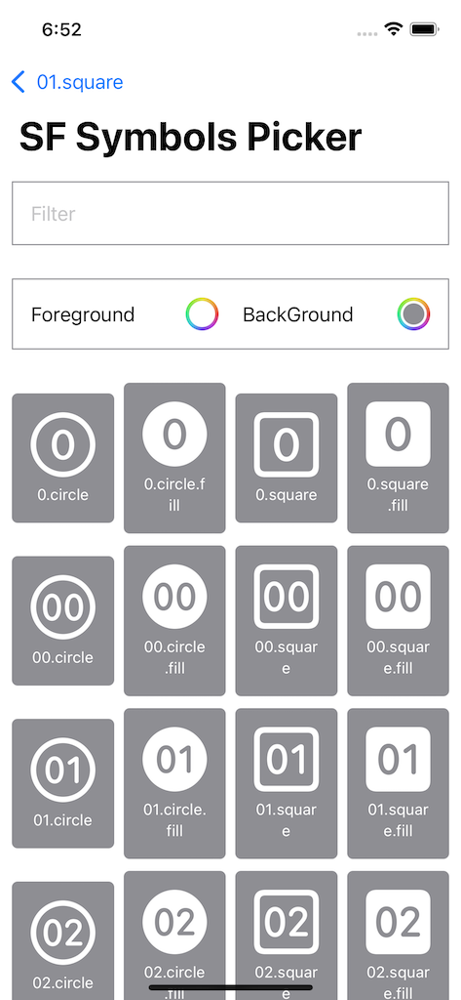
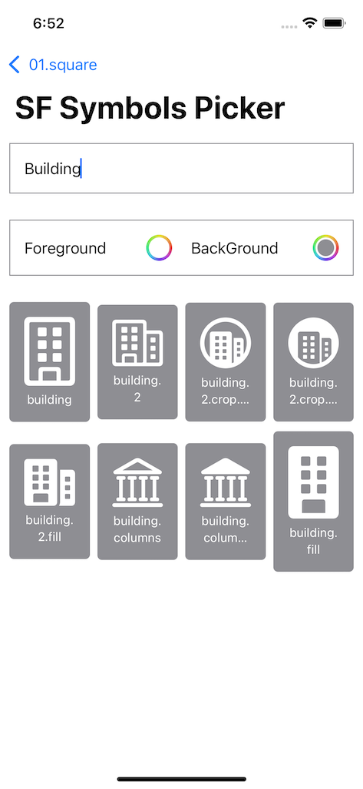
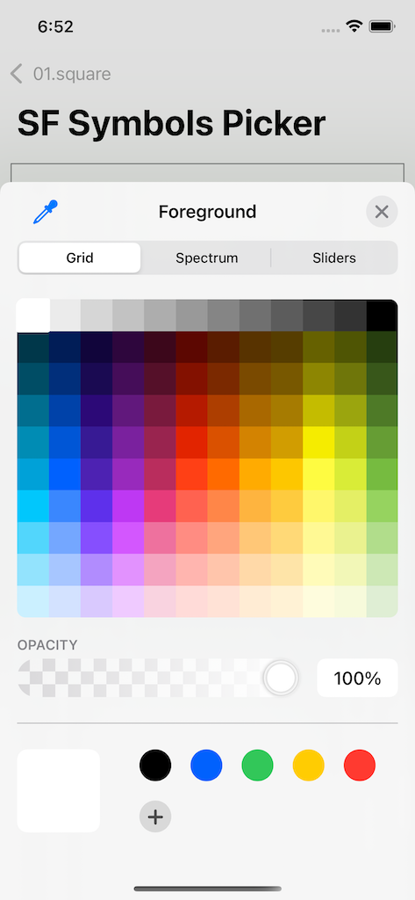
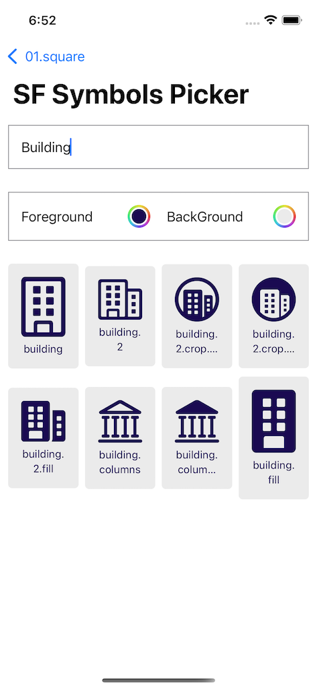

# SFSymbolsPicker

A simple SwiftUI View to pick a [San Francisco Symbols Font](https://developer.apple.com/sf-symbols/) symbol

You will find all symbol names in `SFSymbolNames.swift`. I got all those from https://sfsymbols.com/

## Features

- shows all SF Symbols in a 3 column grid
- can choose foreground and background colors to test how Symbols look
- filter by Symbol name

|Browse |Filter  |
| --- | --- | 
|||

|Pick color |Color applied  |
| --- | --- |
|||

## How to use

- add SFSymbolsPicker as a Package to your project
- add this code:

```swift
import SwiftUI
import SFSymbolsPicker

struct ContentView: View {
    var body: some View {
        NavigationView {
            SFSymbolsPicker { symbol in
                print(symbol)
            }
        }
    }
}
```

`SFSymbolsPicker` accepts a closure that gives you the selected symbol name. Show it using:

```swift
Image(systemName: symbol.symbolName)
```

## Example

There's an Example that let's you select a Symbols, shows it in the main screen and copies the symbol name to the Pasteboard.

## LICENSE 

See [License file](/LICENSE)
